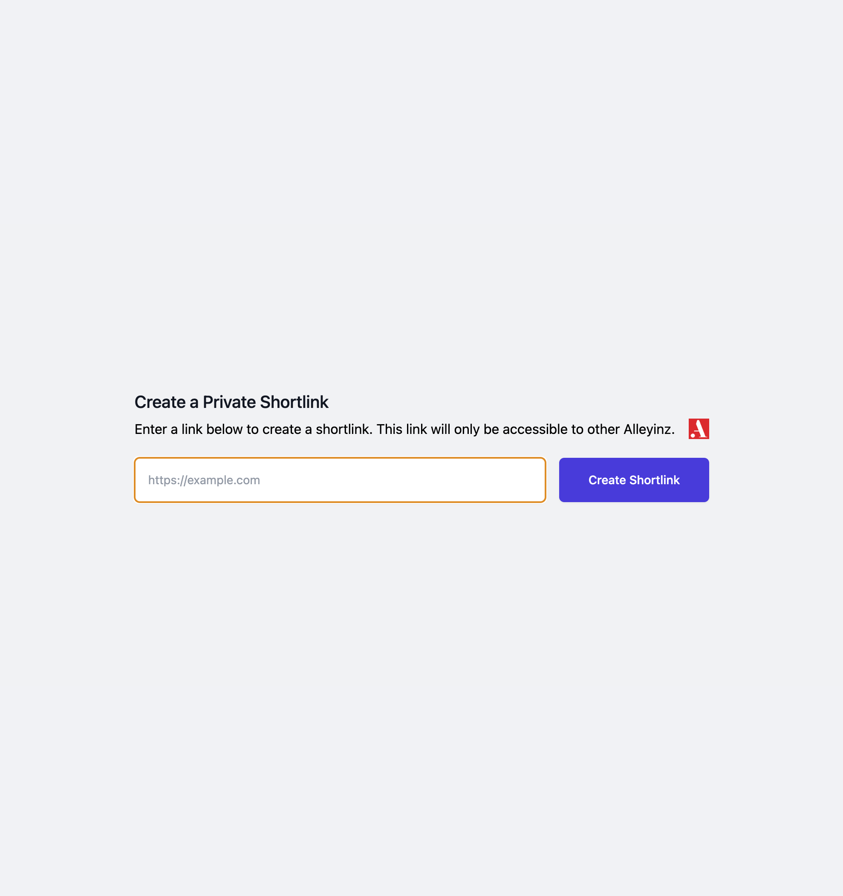

# Link Sharing

A private link-sharing tool for Alleyinz. Users will be prompted to log into the
site before continuing to the link. Used to link to internal resources from
public sites such as GitHub.



## Installation

```bash
apm install link-sharing
```
